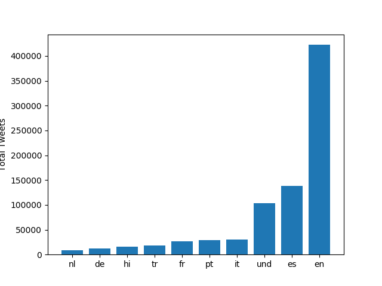
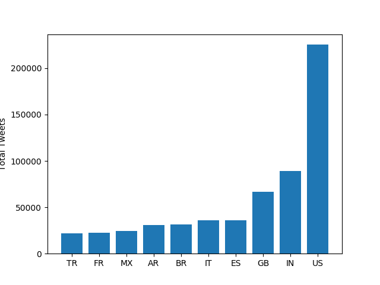
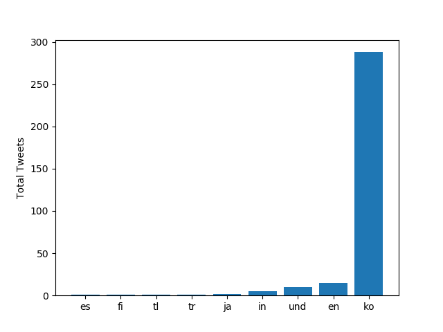
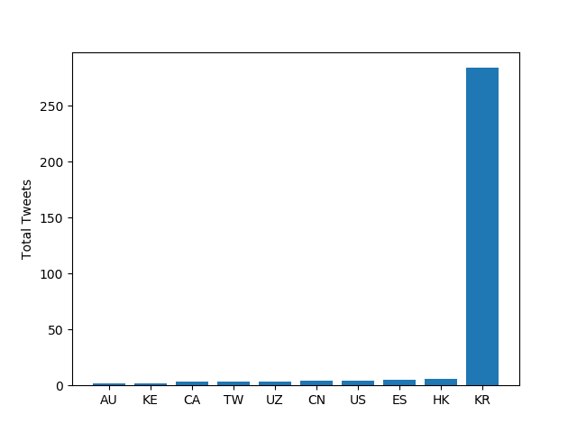
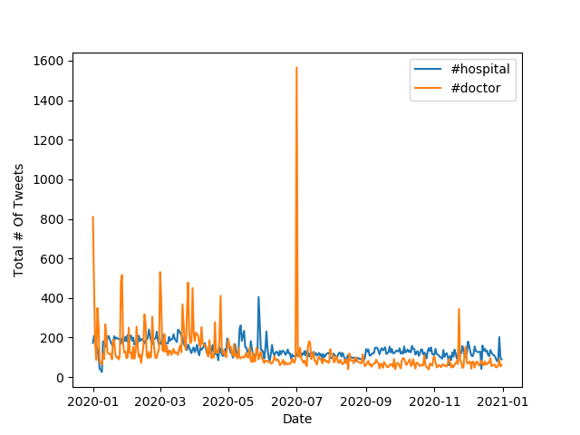

# Coronavirus twitter analysis

In this project, I analyzed tweets related to the Covid-19 pandemic sent in 2020. I primarily used MapReduce which is a popular technique used in large-scle parallel processing. In particular, I used 5 fuctions (`map.py`, `reduce.py`, `visualize.py`, `run_maps.sh` and `alternative_reduce.py`)  to plot the use of #coronavirus and #코로나바이러스 in terms of location and language and ultimately the use of #hospital and #doctor. 

# Results

This section describes the code that was run and the corresponding output:

First graph:

```
python3 ./src/visualize.py --input_path=reduced.lang --key='#coronavirus'
```

This code outputs the graph below. As we can see, #coronavirus was used in English the most, followed by Spanish.



Second graph:

```
$ python3 ./src/visualize.py --input_path=reduced.country --key='#coronavirus'
```

This code outputs the graph below. As we can see, #coronavirus was used in the US and India the most.



Third graph:

```
$ python3 ./src/visualize.py --input_path=reduced.lang --key='#코로나바이러스`
```

This code outputs the graph below:




Fourth graph:

```
$ python3 ./src/visualize.py --input_path=reduced.country --key='#코로나바이러스`
```

This code outputs the graph below:



Fifth graph:

```
$ python3 ./src/alternative_reduce.py --keys '#hospital' '#doctor'
```

This code outputs the graph below:




